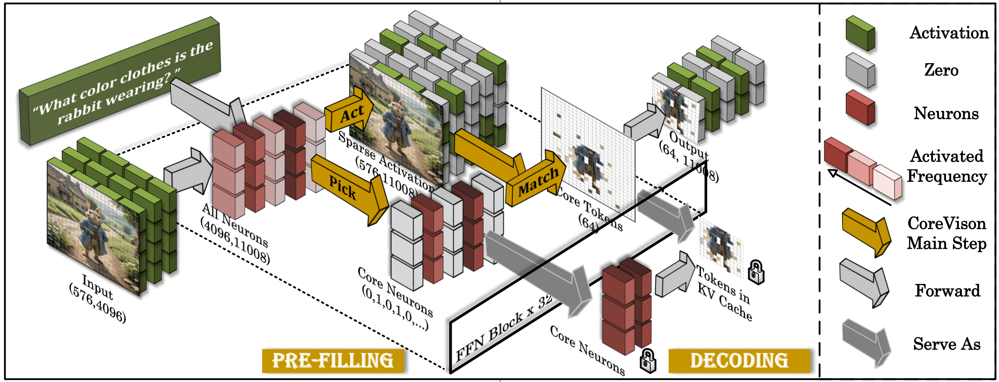
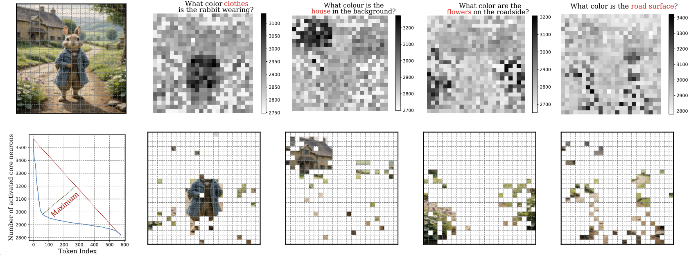

# CoreMatching: Co-adaptive Sparse Inference Framework for Comprehensive Acceleration of Vision Language Model


## TL;DR

We propose CoreMatching, **a co-adaptive sparse inference framework**, which leverages the synergy between token and neuron sparsity to enhance inference efficiency. **For the first time, we theoretically prove why token selection metrics based on angle cosin similarity are superior to metrics based on attention scores.** On the NVIDIA Titan Xp, it achieved 5× FLOPs reduction and a 10× overall speedup.

**Paper Link:** [https://arxiv.org/abs/2505.19235](https://arxiv.org/abs/2505.19235)


**Schematic Diagram of CoreMatching.** In the Pre-filling stage, CoreMatching calculates Core Neurons in the FFN block based on the activation. Core Neurons are the most frequently activated group of neurons. Afterwards, CoreMatching matches the neurons activated by different tokens with the core neurons, and selects a group of tokens with the largest intersection as the Core Tokens. Only the Core Tokens are passed to the subsequent layers. During the decoding stage, the model only uses Core Neurons for calculations, and there are only core tokens in the kv cache. CoreMatching achieves comprehensive acceleration for inference of VLMs.


**The current release version includes:**

✅  **Fast Inference:** You can enter any image and question and get results fast with Corematching.

**✅  Visualization of Core Tokens:** We provide simple Jupyter notebooks to reproduce the visualization results in our paper.

✅  **Performance Evaluation:** Our code architecture is based on LLaVA. You can implement performance evaluation on gqa, mm-vet, mmbench, MME, pope, scienceqa, seed_bench, textvqa, vizwiz and vqav2 through simple code.


## Install

1. Clone the repo and navigate to corematching:

```python
git clone https://github.com/wangqinsi1/corematching.git
cd corematching
```

2. Set up environment:

```python
conda create -yn corematching python=3.10
conda activate corematching
pip install -e .
```


## Fast Inference

We integrate Corematching in *transformers/models/llama*. You can directly input any picture and question to implement fast inference and get the answer.

```python
python inference.py  --image [URL/PATH OF IMAGE]   --question [QUESTION]
```

 Example:

```python
python inference.py  --image "https://huggingface.co/datasets/huggingface/documentation-images/resolve/0052a70beed5bf71b92610a43a52df6d286cd5f3/diffusers/rabbit.jpg"   --question "What color clothes is the rabbit wearing?"
```


## Visualization of Core Tokens

We provide simple Jupyter files in *notebooks/* to reproduce the visualization results in our paper. Corematching can dynamically capture different parts of tokens according to different problems.




**Core token under different inputs.** The left is the schematic diagram of the maximum geometric distance method to select the threshold. The right side is the core token retained under the distribution of the corresponding image above.


## Evaluation

You can quickly start evaluating the task performance. Our code is built on the [LLaVA-v1.5](https://github.com/haotian-liu/LLaVA/tree/main) repository, so you can follow the instructions of them exactly to perform evaluation. 

#### VQAv2

1. Download [`test2015`](http://images.cocodataset.org/zips/test2015.zip) and put it under `./playground/data/eval/vqav2`.
2. Multi-GPU inference.

```Shell
CUDA_VISIBLE_DEVICES=0,1,2,3,4,5,6,7 bash scripts/v1_5/eval/vqav2.sh
```

3. Submit the results to the [evaluation server](https://eval.ai/web/challenges/challenge-page/830/my-submission): `./playground/data/eval/vqav2/answers_upload`.

#### GQA

1. Download the [data](https://cs.stanford.edu/people/dorarad/gqa/download.html) and [evaluation scripts](https://cs.stanford.edu/people/dorarad/gqa/evaluate.html) following the official instructions and put under `./playground/data/eval/gqa/data`. You may need to modify `eval.py` as [this](https://gist.github.com/haotian-liu/db6eddc2a984b4cbcc8a7f26fd523187) due to the missing assets in the GQA v1.2 release.
2. Multi-GPU inference.

```Shell
CUDA_VISIBLE_DEVICES=0,1,2,3,4,5,6,7 bash scripts/v1_5/eval/gqa.sh
```

#### VisWiz

1. Download [`test.json`](https://vizwiz.cs.colorado.edu/VizWiz_final/vqa_data/Annotations.zip) and extract [`test.zip`](https://vizwiz.cs.colorado.edu/VizWiz_final/images/test.zip) to `test`. Put them under `./playground/data/eval/vizwiz`.
2. Single-GPU inference.

```Shell
CUDA_VISIBLE_DEVICES=0 bash scripts/v1_5/eval/vizwiz.sh
```

3. Submit the results to the [evaluation server](https://eval.ai/web/challenges/challenge-page/2185/my-submission): `./playground/data/eval/vizwiz/answers_upload`.

#### ScienceQA

1. Under `./playground/data/eval/scienceqa`, download `images`, `pid_splits.json`, `problems.json` from the `data/scienceqa` folder of the ScienceQA [repo](https://github.com/lupantech/ScienceQA).
2. Single-GPU inference and evaluate.

```Shell
CUDA_VISIBLE_DEVICES=0 bash scripts/v1_5/eval/sqa.sh
```

#### TextVQA

1. Download [`TextVQA_0.5.1_val.json`](https://dl.fbaipublicfiles.com/textvqa/data/TextVQA_0.5.1_val.json) and [images](https://dl.fbaipublicfiles.com/textvqa/images/train_val_images.zip) and extract to `./playground/data/eval/textvqa`.
2. Single-GPU inference and evaluate.

```Shell
CUDA_VISIBLE_DEVICES=0 bash scripts/v1_5/eval/textvqa.sh
```

#### POPE

1. Download `coco` from [POPE](https://github.com/AoiDragon/POPE/tree/e3e39262c85a6a83f26cf5094022a782cb0df58d/output/coco) and put under `./playground/data/eval/pope`.
2. Single-GPU inference and evaluate.

```Shell
CUDA_VISIBLE_DEVICES=0 bash scripts/v1_5/eval/pope.sh
```

#### MME

1. Download the data following the official instructions [here](https://github.com/BradyFU/Awesome-Multimodal-Large-Language-Models/tree/Evaluation).
2. Downloaded images to `MME_Benchmark_release_version`.
3. put the official `eval_tool` and `MME_Benchmark_release_version` under `./playground/data/eval/MME`.
4. Single-GPU inference and evaluate.

```Shell
CUDA_VISIBLE_DEVICES=0 bash scripts/v1_5/eval/mme.sh
```

#### MMBench

1. Download [`mmbench_dev_20230712.tsv`](https://download.openmmlab.com/mmclassification/datasets/mmbench/mmbench_dev_20230712.tsv) and put under `./playground/data/eval/mmbench`.
2. Single-GPU inference.

```Shell
CUDA_VISIBLE_DEVICES=0 bash scripts/v1_5/eval/mmbench.sh
```

3. Submit the results to the [evaluation server](https://opencompass.org.cn/leaderboard-multimodal): `./playground/data/eval/mmbench/answers_upload/mmbench_dev_20230712`.

#### MMBench-CN

1. Download [`mmbench_dev_cn_20231003.tsv`](https://download.openmmlab.com/mmclassification/datasets/mmbench/mmbench_dev_cn_20231003.tsv) and put under `./playground/data/eval/mmbench`.
2. Single-GPU inference.

```Shell
CUDA_VISIBLE_DEVICES=0 bash scripts/v1_5/eval/mmbench_cn.sh
```

3. Submit the results to the evaluation server: `./playground/data/eval/mmbench/answers_upload/mmbench_dev_cn_20231003`.


#### SEED-Bench

1. Following the official [instructions](https://github.com/AILab-CVC/SEED-Bench/blob/main/DATASET.md) to download the images and the videos. Put images under `./playground/data/eval/seed_bench/SEED-Bench-image`.
2. Extract the video frame in the middle from the downloaded videos, and put them under `./playground/data/eval/seed_bench/SEED-Bench-video-image`. We provide our script `extract_video_frames.py` modified from the official one.
3. Multiple-GPU inference and evaluate.

```Shell
CUDA_VISIBLE_DEVICES=0,1,2,3,4,5,6,7 bash scripts/v1_5/eval/seed.sh
```

4. Optionally, submit the results to the leaderboard: `./playground/data/eval/seed_bench/answers_upload` using the official jupyter notebook.

#### MM-Vet

1. Extract [`mm-vet.zip`](https://github.com/yuweihao/MM-Vet/releases/download/v1/mm-vet.zip) to `./playground/data/eval/mmvet`.
2. Single-GPU inference.

```Shell
CUDA_VISIBLE_DEVICES=0 bash scripts/v1_5/eval/mmvet.sh
```

3. Evaluate the predictions in `./playground/data/eval/mmvet/results` using the official jupyter notebook.

#### Q-Bench

1. Download [`llvisionqa_dev.json`](https://huggingface.co/datasets/nanyangtu/LLVisionQA-QBench/resolve/main/llvisionqa_dev.json) (for `dev`-subset) and [`llvisionqa_test.json`](https://huggingface.co/datasets/nanyangtu/LLVisionQA-QBench/resolve/main/llvisionqa_test.json) (for `test`-subset). Put them under `./playground/data/eval/qbench`. 
2. Download and extract [images](https://huggingface.co/datasets/nanyangtu/LLVisionQA-QBench/resolve/main/images_llvisionqa.tar) and put all the images directly under `./playground/data/eval/qbench/images_llviqionqa`.
3. Single-GPU inference (change `dev` to `test` for evaluation on test set).

```Shell
CUDA_VISIBLE_DEVICES=0 bash scripts/v1_5/eval/qbench.sh dev
```

4. Submit the results by instruction [here](https://github.com/VQAssessment/Q-Bench#option-1-submit-results): `./playground/data/eval/qbench/llvisionqa_dev_answers.jsonl`.

   

## Paper and Citation

More technical details can be found in our paper. If you find Corematching useful or relevant to your project and research, please kindly cite our paper:

```
@misc{wang2025corematchingcoadaptivesparseinference,
      title={CoreMatching: A Co-adaptive Sparse Inference Framework with Token and Neuron Pruning for Comprehensive Acceleration of Vision-Language Models}, 
      author={Qinsi Wang and Hancheng Ye and Ming-Yu Chung and Yudong Liu and Yueqian Lin and Martin Kuo and Mingyuan Ma and Jianyi Zhang and Yiran Chen},
      year={2025},
      eprint={2505.19235},
      archivePrefix={arXiv},
      primaryClass={cs.LG},
      url={https://arxiv.org/abs/2505.19235}, 
}
```


